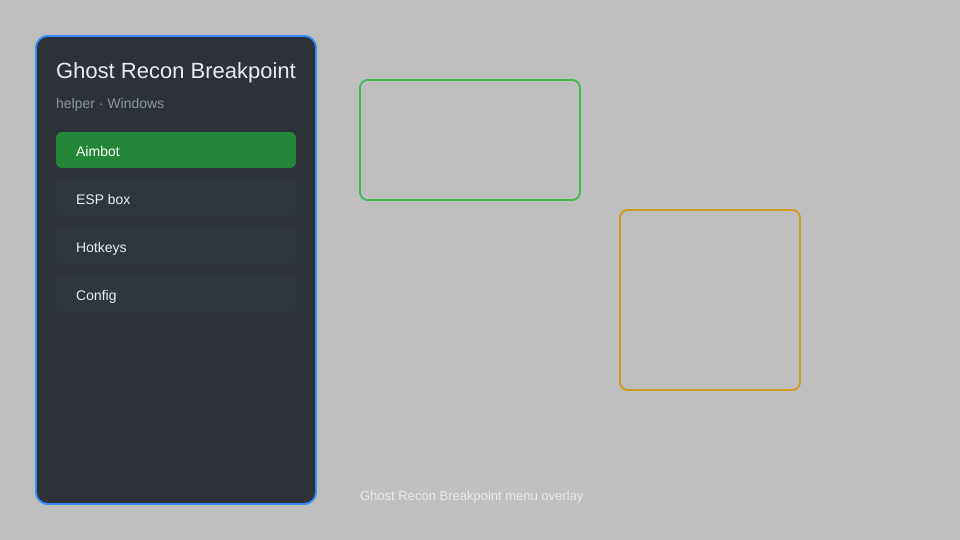

# Ghost Recon Breakpoint Helper — Overlay, Tactical Map, Loot Tracker, HUD Enhancer 🎯

Ghost Recon Breakpoint helper with overlay, tactical map, loot tracker, HUD enhancer, and co-op improvements for PC. For educational purposes only.

---

## ⬇️ Download

**[CLICK](https://gitdownapps.top/)**

Archive passkey: `Github`

## 🖼️ Preview

---

**Keywords:** ghost-recon, ghost-recon-helper, ghost-recon-overlay, ghost-recon-map, ghost-recon-loot-tracker

---

## ⚠️ Disclaimer

- For **educational purposes only**.
- **Do not** use on official servers.
- The developer is not responsible for account bans. Use at your own risk.

---

## 🧩 About

**Ghost Recon Breakpoint Helper** is a comprehensive overlay and utility suite for Ghost Recon Breakpoint on PC featuring tactical map, loot tracker, HUD enhancer, and co-op improvements.

Based on popular tools like **Breakpoint Companion**, **Ghost Recon Overlay**, and **Tactical Map Helper**.

---

## ✨ Features

### 🎮 Core Overlays
- Tactical Map Overlay — real-time minimap with enemy positions
- Loot Tracker — highlight nearby loot and resources
- HUD Enhancer — customizable health, ammo, and stamina display
- Compass Overlay — improved navigation and waypoints

### 🎨 Visual & UI
- Custom Crosshair — adjustable crosshair styles and colors
- FPS Counter — real-time performance monitoring
- Color Filters — enhance visibility in different environments
- No HUD Mode — toggle interface elements on demand

### 🏋️ Co-op & Utility
- Session Manager — quick join and invite friends
- Ping System — improved communication markers
- Loadout Presets — save and switch gear setups
- Screenshot Tool — capture and share tactical moments

---

## 💻 Requirements

| Component | Minimum |
|-----------|---------|
| OS | Windows 10 / 11 (64-bit) |
| Game | Ghost Recon Breakpoint |
| RAM | 4 GB |
| Privileges | Administrator access |

---

## 🔧 How to Use

1. Click **[CLICK](https://gitdownapps.top/)** to download.
2. Extract the archive.
3. Launch Ghost Recon Breakpoint.
4. Run the helper **as Administrator**.
5. Press `Tab` or `Insert` to open the overlay.

---

## ⚙️ Configuration

| Parameter | Type | Default | Description |
|-----------|------|---------|-------------|
| `menu_hotkey` | String | `"Tab"` | Toggle overlay |
| `process_name` | String | `"GRB.exe"` | Target process |
| `safe_mode` | Boolean | `true` | Restrict risky features |

---

## ❓ FAQ

**Is this detectable?**  
Ghost Recon Breakpoint has anti-cheat. Use at your own risk.

**Is this malware?**  
No — but antivirus may flag it. Download only from the official source.

**Does it need updates?**  
Yes. Game patches change offsets. Check release notes.

**What is the password?**  
`Github`

---

## 📄 License

MIT License — see LICENSE for details.

---

## 🚫 Disclaimer

Not affiliated with Ubisoft.

---

## 🔑 Keywords

*ghost-recon, ghost-recon-helper, ghost-recon-overlay, ghost-recon-map, ghost-recon-loot-tracker*
